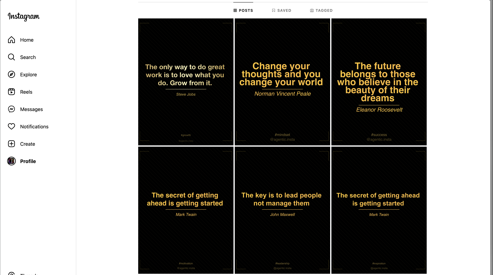

# Instagram Quote Generator & Auto-Poster

An elegant Node.js application that automatically generates and posts motivational quotes to Instagram with a luxurious black and gold theme.



## Features

- 🎨 **Luxury Design**
  - Black and gold color scheme
  - Professional typography with Roboto font family
  - Elegant decorative elements
  - High-quality image generation (1080x1350)

- 🤖 **AI-Powered Quotes**
  - Uses Google's Gemini AI for quote generation
  - Curated topics: success, motivation, leadership, etc.
  - Smart content filtering and formatting

- 📱 **Instagram Integration**
  - Automated posting with safety measures
  - Scheduled posts at optimal times
  - Hashtag optimization
  - Account safety features

- 🛡️ **Safety Features**
  - Rate limiting
  - Post scheduling
  - Error handling
  - Account protection measures

## Setup

1. Install dependencies:
```bash
npm install
```

2. Create a `.env` file with your credentials:
```env
INSTAGRAM_USERNAME=your_username
INSTAGRAM_PASSWORD=your_password
GEMINI_API_KEY=your_gemini_api_key
```

3. Run the application:
```bash
# For scheduled posting
node index.js

# For single test post
node test-post.js
```

## Configuration

The application includes configurable parameters for:
- Posting schedule
- Safety limits
- Image dimensions
- Design elements
- Topic selection

## Tech Stack

- Node.js
- Canvas for image generation
- instagram-private-api
- Google Gemini AI
- PM2 for process management

## Preview

The above image showcases our luxury black and gold theme with:
- Clean, modern typography
- Professional gradient effects
- Elegant decorative elements
- Perfect Instagram dimensions (4:5 ratio)

## License

MIT License - feel free to use and modify as needed.

---
Search on Instagram: @naeem.pansota
Made with ♥️ by naeem.pansota 